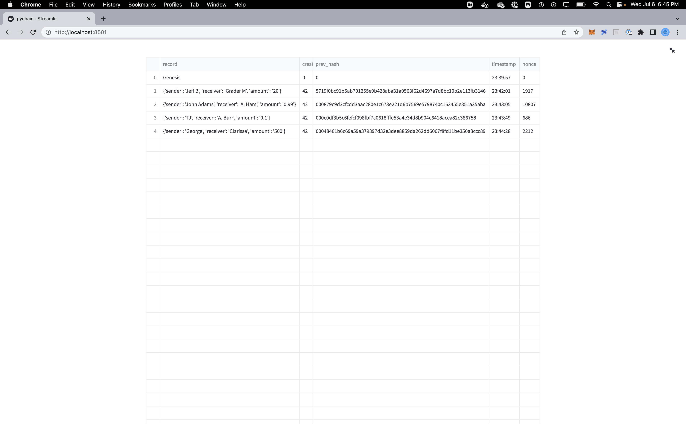
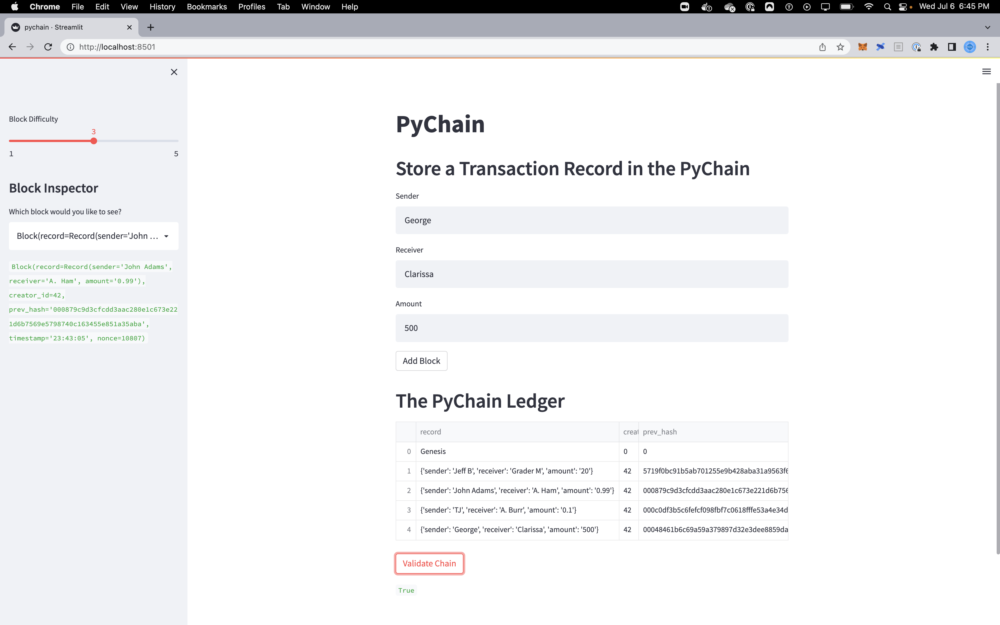

# PyChain Ledger

**User Story** -  *You’re a fintech engineer who’s working at one of the five largest banks in the world. You were recently promoted to act as the lead developer on their decentralized finance team. Your task is to build a blockchain-based ledger system, complete with a user-friendly web interface. This ledger should allow partner banks to conduct financial transactions (that is, to transfer money between senders and receivers) and to verify the integrity of the data in the ledger.*

## Assignment objective: Create a blockchain with a Streamlit interface.

1. Create a data class named `Record`--will serve as blueprint for financial transaction records that the blocks of the ledger will store.

2. Use `Block` data class to store `Record` data.

3. Add User Inputs to the Streamlit interface.

4. Test the PyChain Ledger by Storing Records.

---
## Files

Code: [pychain.py](pychain.py)

Images:

• [Blockchain ledger](Images/blockchain.png)

• [Main page with validation](Images/validated.png)

---

© 2021 Trilogy Education Services, a 2U, Inc. brand. All Rights Reserved.